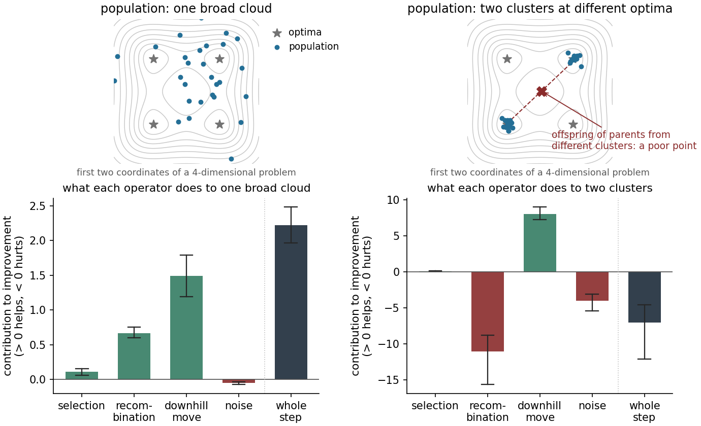
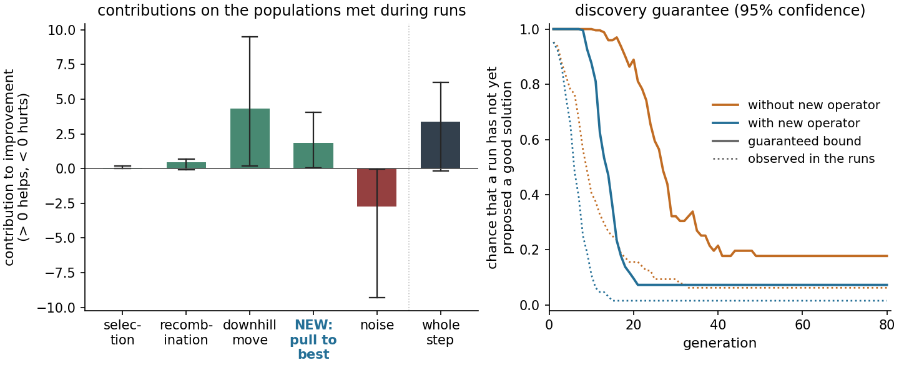

# EvoScope

**Find out what each part of your population-based optimizer does, and whether the
combination can be trusted, without doing the mathematics.**

EvoScope is a Python toolbox for people who design evolution strategies, genetic
algorithms, particle-swarm and consensus methods, or population-based optimizers of their
own. You write the update rules in plain Python. EvoScope checks them, measures what each
one contributes, and states guarantees about how reliably the algorithm finds good
solutions. Every result comes with an explanation in plain language.

## Why EvoScope?

A population-based optimizer is assembled from ingredients: selection, recombination
(crossover), mutation, moves towards good points, restarts. New algorithms usually arise by
adding or changing one ingredient and benchmarking the whole algorithm. The benchmark shows
*whether* the results change. It does not show

* **which ingredient** is responsible, and whether its effect carries over to other
  problems or to other stages of a run;
* whether the new ingredient **breaks something** that made the algorithm work;
* how sure you can be that a run of a given length has **actually found a good solution**.

EvoScope answers these questions numerically, from your code, while an idea is still
cheap to change.

## The idea in one picture



Think of one generation of an algorithm as a sequence of update rules, called
**operators**, each applied with a small **step size**. At a given population, EvoScope
measures the **contribution** of each operator: the relative rate at which it reduces the
population's *mean gap*, the average of `f(x) - f*` over the population. A positive
contribution means the operator helps, a negative one that it hurts. When every operator
passes four checks (below), **the contributions add up**: for small steps, the whole step
changes the population by the sum of what its operators do separately. The behaviour of
an algorithm can therefore be split into the effects of its ingredients, and an
ingredient can be replaced or added without redoing the rest of the analysis.

The figure applies this to one step of an algorithm with four operators, on a
four-dimensional problem with 16 optimal points. Each bar is the median over 48
populations; the whiskers show the range. On a broad population every operator except the
noise helps. On a population split between two optima, recombination is strongly harmful:
the child of parents from different clusters lands between them, in a poor region (top
right). The same operator helps or hurts depending on the shape of the population, and on
this population the whole step makes things worse although the downhill move works well.
An average over benchmark runs does not show this. ([Tutorial 1](tutorials/01_first_steps.py))

## Example: what does a new operator add?



An algorithm made of selection, recombination, a downhill move and noise is extended by a
new operator that pulls every individual towards a weighted average that favours the
best individuals. The problem has a good optimum and a worse local one. EvoScope ran each
version 64 times.

* **Left: attribution.** On the 256 populations met during the runs of the extended
  algorithm (at generations 0, 10, 40 and 80), the new operator helps on every one. The
  downhill move contributes most; the noise, which keeps the population spread out, costs
  most.
* **Right: discovery guarantee.** In every generation EvoScope draws extra candidates from
  the algorithm's proposals, evaluates them and discards them, to measure how much of what
  the algorithm proposes is good (here: within 0.1 of the optimal value). From these
  measurements it computes an upper bound, at 95% confidence, on the chance that a run has
  not yet proposed a good solution. With the new operator the bound at generation 40 falls
  from 0.22 to 0.07, and the observed frequency from 6.2% to 1.6%. With 64 runs no bound
  can go below about 0.05; more runs allow smaller bounds.

The whole example, including what removing each operator changes along the runs, is
[Tutorial 3](tutorials/03_from_operators_to_an_algorithm.py).

## Gradient methods are special cases

Gradient descent is the simplest case: one operator, a move along `-grad f` with step size
equal to the learning rate, applied to a population of one individual (or of many
independent starts). EvoScope's quantities then reduce to familiar ones:

* the **drift coefficient** (the smallest improvement rate) is the constant `2 mu` of the
  Polyak-Lojasiewicz inequality `|grad f|^2 >= 2 mu (f - f*)`, the classical sufficient
  condition for linear convergence of gradient descent, which does not need convexity;
* the **moment-stability check** (A2) plays the role of the step-size condition: plain
  gradient steps fail it where the curvature grows without bound, and gradient clipping
  fixes them;
* **noisy gradient descent** (Langevin dynamics; SGD in the usual Gaussian approximation of
  the gradient noise) converges linearly down to a floor, which EvoScope estimates.

Gradient steps also combine with population operators. On a problem with a good and a
worse well, multi-start gradient descent stalls when some starts end in the worse well;
adding selection drives the mean gap to zero, and the attribution shows the hand-over from
the gradient step to selection. See [Tutorial 6](tutorials/06_gradient_methods.py).

## Three ways in

| You have | EvoScope tells you | Start with | Guide | Tutorial |
|---|---|---|---|---|
| an idea for a new operator | whether it passes the four checks, and if not, what to change | `checks.check_operator` | [guide](docs/guide-operator.md) | [02](tutorials/02_checking_a_new_operator.py) |
| operators to combine, or a new operator for an existing algorithm | whether the contributions add up, what each operator contributes on the populations your algorithm meets, the discovery guarantee | `checks.check_assembly`, `attribution`, `algorithm.ablation_runs` | [guide](docs/guide-assembly.md) | [03](tutorials/03_from_operators_to_an_algorithm.py) |
| an algorithm that already runs (ask/tell interface), not split into operators | failure diagnostics, how much one generation improves the population, what switching a component off changes along whole runs, the discovery guarantee | `algorithm.check_algorithm` | [guide](docs/guide-algorithm.md) | [04](tutorials/04_black_box_algorithm.py) |

New here? Read [the concepts in plain language](docs/concepts.md), then
[Tutorial 1](tutorials/01_first_steps.py).

## The four checks on an operator

Contributions are well defined and add up only for operators that behave regularly when
the step size is small. EvoScope tests this numerically on populations you choose. The
reports label the four checks A1-A4:

| Check | Question | Typical cause of failure | Fix |
|---|---|---|---|
| A1 first-order effect | Does a small step have a definite effect per unit of step size? | the rule ignores the step size | move by `tau` times a direction, perturb by `sqrt(tau)` times noise, or replace a fraction `tau` of the population |
| A2 moment stability | Does one step keep the population from spreading out without bound? | plain gradient steps on steep objectives, heavy-tailed noise | normalize or clip the move, use light-tailed noise |
| A3 near identity | Does a small step change the population only a little? | the rule ignores the step size | as for A1 |
| A4 continuity | Does the contribution change gradually when the population changes slightly? | hard thresholds: best-of comparisons, truncation by rank, if-statements on the objective | soft versions: weighted averages, smoothed ranks, sigmoids |

An operator that fails a check may still be useful, but its contribution cannot be
attributed or combined with those of other operators in the way shown above.

## Installation

Python 3.10 or newer; depends on NumPy, SciPy and Matplotlib.

```sh
git clone https://github.com/pma-papers/evoscope.git
cd evoscope
pip install -e .
```

## A first check

A common idea: pull every individual towards the current best one. Written as a move
with step size `tau` (a `Transport`: `x -> x + tau * drift + sqrt(tau) * noise`):

```python
import numpy as np
from evoscope import checks, problems
from evoscope.operators import Transport
from evoscope.population import broad_gaussian, two_cluster

f = problems.get("wells_d4")                    # a test problem, or your own objective
rng = np.random.default_rng(0)
populations = [broad_gaussian(16, 4, rng), two_cluster(16, 4, rng)]   # kinds of population to test on

def towards_best(x, pop):                       # direction from each individual to the best one
    best = pop.points[np.argmin(f.value(pop.points))]
    return best - x

report = checks.check_operator(Transport(drift=towards_best, sigma=.1, name="pull"), populations, fast=True)
print(report.summary())                         # verdicts with plain-language explanations
report.plot("check.png")                        # diagnostic panels
```

The summary (abridged):

```
Operator check: pull (2 populations, 8 test functions)
first-order effect (A1)            consistent    changes between step sizes ~ tau^0.93; ...
moment stability (A2)              consistent    largest moment ratio after one step (tau=0.1): 0.852 ...
near identity (A3)                 consistent    d*(T_tau mu, mu) ~ 3.12 tau^0.95
continuity in the population (A4)  violated      largest rate of change 19.9; last refinement x4 changes it x4.06

* continuity in the population (A4) [violated]
    The effect jumps when the population changes slightly: the rule contains a discontinuity,
    typically a hard threshold such as truncation by rank or an exact best-of comparison. Replace it
    by a smoothed version (a soft rank or a sigmoid instead of a step).
```

Which individual is best can switch when the population changes slightly, and the target
of the pull then jumps. Pulling towards a weighted average that favours good individuals
removes the jump:

```python
def towards_soft_best(x, pop, alpha=5.):
    values = f.value(pop.points)
    w = pop.weights*np.exp(-alpha*(values - values.min()))
    return w @ pop.points / w.sum() - x
```

With this drift all four checks are consistent (the largest rate of change drops from 19.9
to 0.35 and no longer grows when the check looks closer). This is the new operator of the
example above. [Tutorial 2](tutorials/02_checking_a_new_operator.py) follows the idea
through three versions.

Operators are written in whatever form is closest to how you think of them: a move of each
individual, a reweighting (selection), a generator of offspring (crossover and variation),
or any update function. No derivatives or formulas are needed.

## What the results mean, and what they do not

* **Evidence, not proof.** The checks examine the populations, runs and states you give
  them; "consistent" means that nothing there contradicts the property. Use populations of
  the kinds your algorithm meets: broad and clustered, far from the optimum and near it,
  and populations from late generations of real runs.
* **Contributions are local.** They describe small steps at a given population. Measured
  over the populations an algorithm actually meets, they explain what its ingredients do;
  they do not replace runs.
* **The discovery guarantee is a genuine guarantee** about the algorithm as run, at a
  stated confidence level. It needs no knowledge of the optimum beyond the definition of a
  good solution.

## Documentation

| | |
|---|---|
| [Start here](docs/index.md) | which situation you are in, and a five-minute start |
| [Concepts](docs/concepts.md) | populations, operators, step sizes, effects, error measures, drift coefficients, discovery guarantees, in plain language |
| Guides | [checking a new operator](docs/guide-operator.md), [combining operators](docs/guide-assembly.md), [checking an implemented algorithm](docs/guide-algorithm.md) |
| [Reading the reports](docs/reading-reports.md) | every check: what it tests, what each verdict means, what to do |
| [FAQ](docs/faq.md), [API](docs/api.md) | questions, and the API at a glance |
| [Tutorials](tutorials/) | six runnable walk-throughs, also as notebooks in `tutorials/notebooks/` |

The tutorials: (1) what each operator does; (2) taking an operator idea through three
versions until it passes every check; (3) adding a new operator to an existing algorithm
and measuring what it adds; (4) checking an algorithm written without EvoScope;
(5) discovery guarantees in practice; (6) gradient descent, noisy gradient descent and
multi-start gradient descent as special cases.

## Background

EvoScope implements the operator calculus of

> P. Malo, L. Viitasaari, P. Nummi, A. Suominen, A. Sinha, O. Tahvonen.
> *Operator Calculus for Population-Based Optimization: Modular Convergence and
> Finite-Population Guarantees.* arXiv:2606.14289.

The paper proves that, under the four conditions checked above, the first-order effects of
separately specified operators add up (the composition theorem). Convergence arguments can
then be assembled operator by operator, and performance can be attributed to operators.
The paper also gives guarantees for finite populations, among them the measured discovery
bound. EvoScope's checks are the numerical counterparts of these conditions and results;
the [theory map](docs/theory-map.md) lists the correspondence and what a numerical check
cannot establish. The test suite verifies that EvoScope reproduces the numbers of the
paper's numerical study, whose code is at
[operator-calculus-reproduction](https://github.com/pma-papers/operator-calculus-reproduction).

## Repository layout

```
src/evoscope/      the package
  operators.py       operator wrappers (Transport, Reweighting, Jump, StepOperator), ready-made operators, Assembly
  checks.py          operator- and assembly-level checks
  algorithm.py       ask/tell interface, runs with probes, algorithm-level checks, ablation
  attribution.py     effects of operators, drift coefficients, validation
  discovery.py       the discovery guarantee
  report.py          reports with verdicts and plain-language explanations
  population.py, problems.py, testfunctions.py, metrics.py, contrasts.py, viz.py
  criterion.py, band.py, modulus.py, runs.py   advanced: the paper's theorem-level evaluation criterion
docs/              documentation and figures
tutorials/         runnable tutorials and notebooks/
examples/          short examples
tests/             unit tests, including known pass/fail cases for every check
tools/             maintainer tools (test fixtures, notebooks, the figures of this page)
```

## Tests

```sh
python -m unittest discover -s tests       # about 10 seconds; pytest also works
```

## Status

Version 0.2.0.dev0, under active development. Planned: ready-made wrappers for common
algorithms (CMA-ES-type, recombinative ES, consensus-based optimization) with their known
guarantees, examples with popular libraries through the ask/tell interface, a
documentation website, and a PyPI release. Questions, issues and contributions are welcome.

## Citation and license

If you use EvoScope, please cite the paper above (see `CITATION.cff`). EvoScope is
released under the [MIT License](LICENSE).
