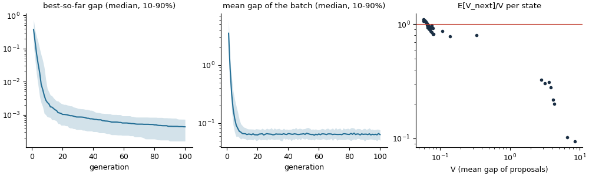
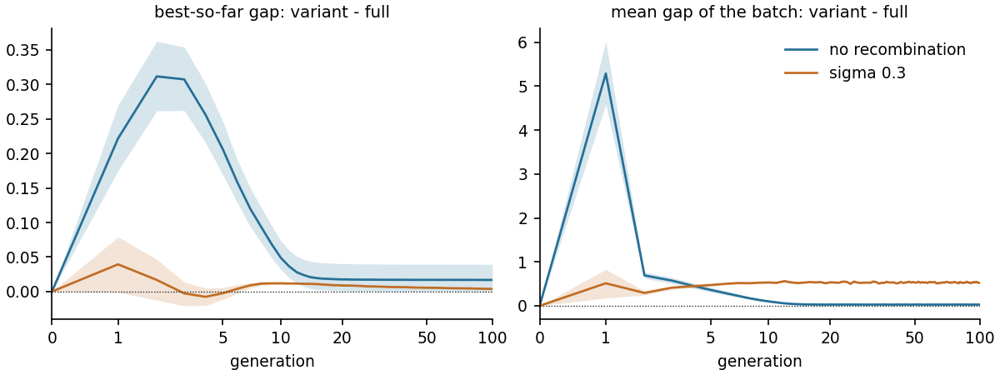

# Guide: checking an implemented algorithm

Your algorithm already runs, and you would rather not split it into operators. The
toolbox can still answer the main questions of the theory about a whole generation. The
full worked example is [Tutorial 4](../tutorials/04_black_box_algorithm.py).

## Step 1: give the algorithm an ask/tell interface

Three functions describe any population-based algorithm:

* `initialize(rng) -> state`
* `ask(state, size, rng) -> candidates`: draw `size` candidates from the algorithm's
  current proposal distribution, **without changing the state**;
* `tell(state, candidates, values, rng) -> new state`.

```python
from evoscope import algorithm

def initialize(rng):
    return rng.normal(0, 1, (40, d))                     # the state: here the current parents

def ask(parents, size, rng):
    pairs = parents[rng.integers(0, len(parents), (size, 2))]
    return .5*(pairs[:, 0]+pairs[:, 1])+.1*rng.normal(size=(size, d))

def tell(parents, candidates, values, rng):
    return candidates[np.argsort(values)[:10]]           # keep the 10 best

es = algorithm.FunctionalAlgorithm(initialize, ask, tell, batch_size=40, population=lambda s: s)
```

`population` (optional) returns the current population, used for spread diagnostics.

For an optimizer object with `ask(n)` and `tell(X, values)` methods (as in many
evolution-strategy libraries):

```python
opt = algorithm.AskTellAlgorithm(factory=lambda rng: MyOptimizer(seed=int(rng.integers(2**31))), batch_size=20)
```

Probes are then drawn from a copy of the object. If the object keeps its own random
generator, pass `reseed=lambda obj, rng: ...` to give the copy fresh randomness, so that
probes are independent of the next real batch.

The state must be copyable with `copy.deepcopy` (arrays, dictionaries and most objects
are).

## Step 2: the algorithm-level report

```python
report = algorithm.check_algorithm(es, f, level=.1, rng=np.random.default_rng(0),
                                   generations=100, repetitions=128)
print(report.summary())
report.plot("algorithm_check.png")
```

`f` is the objective as a vectorized function; `level` defines the target set
`{f <= level}` (`f_* + eps` if the optimum value is known, otherwise see the
[FAQ](faq.md#what-if-i-do-not-know-the-optimum)).



The report contains:

* **run diagnostics**: runs that collapse at a point that is not good (agreement without
  optimality), stall above the level, or blow up;
* **discovery guarantee**: the measured bound on the probability that no candidate in the
  target set has been proposed by the last generation;
* **per-generation contraction**: for states taken from the runs, the mean gap of the
  proposals after one generation divided by the mean gap before (right panel). Below one
  everywhere means geometric decrease; otherwise the report gives a floor below which no
  decrease is guaranteed.

## Step 3: what does each ingredient contribute?

If the algorithm has switches (crossover on/off, noise level, a new heuristic), make one
algorithm object per variant, sharing the state format, and pass them:

```python
variants = {"full": es, "no recombination": make_es(recombine=False), "sigma 0.3": make_es(sigma=.3)}
report = algorithm.check_algorithm(es, f, level=.1, rng=rng, variants=variants, reference="full")
contrast = algorithm.ablation_runs(variants, "full", f, generations=100, repetitions=128)
```

The report adds the per-generation effect of each switch (same random numbers for every
variant), and `ablation_runs` follows the variants along whole runs from the same starts:



## Step 4 (optional): a step-size parameter

If the update can be made smaller with a parameter `tau` (with `tau = 0` meaning "keep the
population as it is"), `check_small_step(make_alg, states, f)` tests whether the whole
update behaves like one small-step operator. If it does, its first-order effect and drift
coefficient are estimated, and the calculus applies to the algorithm as a single operator.
Many algorithms have such a parameter in some form: a learning rate, a replacement
fraction, a mutation strength paired with a selection pressure.

## When to decompose

When the diagnostics or the ingredient effects point at one component, write that
component as an operator and check it as in [Checking a new operator](guide-operator.md).
That is also the route to certificates that hold beyond the states you sampled.
