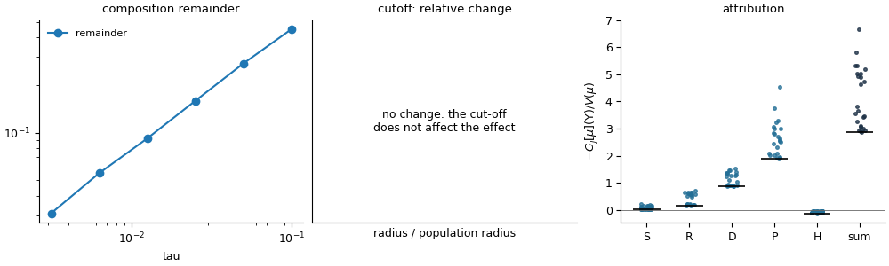
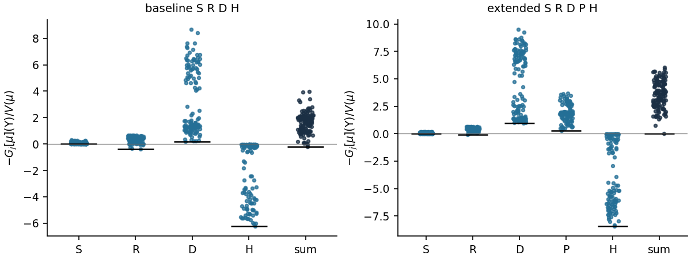
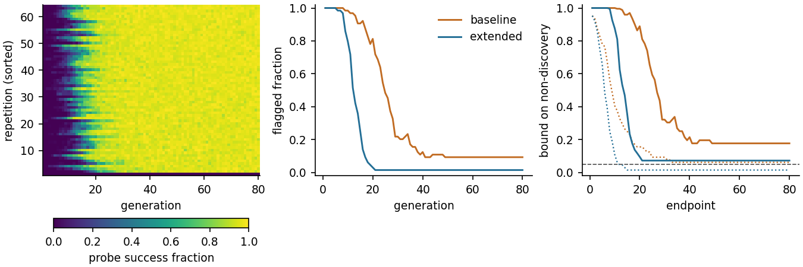
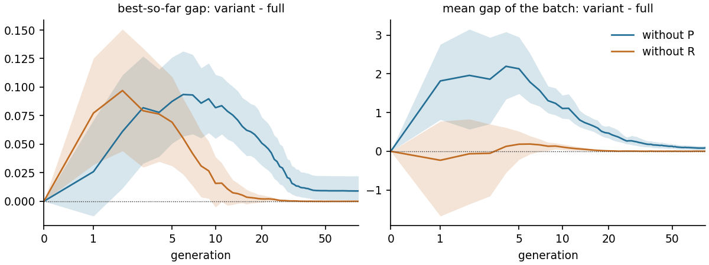

# Guide: combining operators

You have operators (your own, or ready-made ones) and want to combine them into an
algorithm, or add a new operator to an existing one, and understand what each contributes.
The full worked example is [Tutorial 3](../tutorials/03_from_operators_to_an_algorithm.py),
which adds the pull operator of Tutorial 2 to the paper's algorithm.

## Step 1: build the assembly

An `Assembly` applies operators in list order; the first entry acts first.

```python
from evoscope.operators import Assembly, Drift, GaussianNoise, Recombination, Selection, normalized_fd_drift, objective_rate

S = Selection(objective_rate(f.value))          # reweighting by f/(1+f)
R = Recombination()                             # midpoint crossover, replacing a fraction tau
D = Drift(normalized_fd_drift(f.value))         # derivative-free downhill move, normalized
H = GaussianNoise(.2)                           # Gaussian mutation
algorithm_step = Assembly([S, R, D, my_operator, H])
```

## Step 2: the assembly check

```python
from evoscope import checks
report = checks.check_assembly(algorithm_step, populations, f, fast=True)
print(report.summary())
report.plot("assembly_check.png")
```



The report contains:

* the **operator checks** of every component (summarized; run `check_operator` for the
  details);
* **composition**: the composed step's change minus the sum of the operators' effects,
  which should shrink in proportion to the step (left panel);
* **unbounded error measure**: whether the mean objective gap can be used as the error
  measure (relevant when an operator sends mass very far away);
* **drift coefficient and attribution**: every operator's contribution to the reduction
  of the mean gap, population by population (right panel), and the smallest total rate.

## Step 3: attribution on the populations your algorithm meets

The drift coefficient matters all along a run, and populations change a lot during a run.
Collect populations from runs and compute the attribution there:

```python
from evoscope import algorithm, attribution, viz
alg = algorithm.AssemblyAlgorithm(algorithm_step, tau=.1, initial=lambda g: broad_gaussian(32, d, g), population_size=32)
runs = algorithm.run_repetitions(alg, f.value, 80, 64, rng, keep_states={0, 10, 40, 80})
states = [s for row in runs["states"] for s in row]
result = attribution.coefficients(algorithm_step, states, f)
viz.plot_component_coefficients(result)
```



*Each dot is a population met during a run; a positive value means the operator reduces
the mean gap there. Left: the paper's algorithm. Right: with the new operator `P`, which
raises the total rate and makes its minimum positive.*

## Step 4: the drift coefficient and its validation

```python
lam = attribution.estimate_drift_coefficient(result["total"])        # smallest total rate
check = attribution.validate(lam, fresh_result["total"], n_calibration=len(states))
```

Compute `fresh_result` on populations not used for the estimate (for example states from
other runs). If the fresh populations are like the sampled ones, about a fraction
`1/(n+1)` of them fall below the minimum of `n`; many more means the sample was not
representative (typically: it lacked late-generation populations). If `lam` is negative,
the attribution shows which operator is responsible; if the rate is positive except near
the optimum, use the residual form:

```python
c = attribution.residual_constant(result["generator"], result["V"], lam=1.)
# the mean gap decreases at rate 1 until it is of the order of c
```

## Step 5: runs, discovery and ablation

Run the assembly as an algorithm with probes to get a **discovery guarantee**, and
compare variants along whole runs with **ablation contrasts**:

```python
runs = algorithm.run_repetitions(alg, f.value, 80, 128, rng, level=.1, n_probe=128)
print(algorithm.check_discovery(runs, batch=32, level=.1, n_probe=128).statistic)

variants = {"full": alg, "without P": algorithm.AssemblyAlgorithm(Assembly([S, R, D, H]), .1, init, 32)}
contrast = algorithm.ablation_runs(variants, "full", f.value, generations=80, repetitions=64)
```





*Ablation along runs: variant minus full algorithm, run by run from the same initial
populations, with 95% bootstrap bands. Positive means the variant is worse.*

## Choosing the step size and population size

`tau` controls how much one generation changes the population; the theory describes small
steps, and the composition check tells you up to which `tau` the effects still add up
well. The population size `N` controls randomness: small populations discover good points
with fewer evaluations but fail more often; the discovery bound and the observed failure
frequency show the trade-off on your problem.
