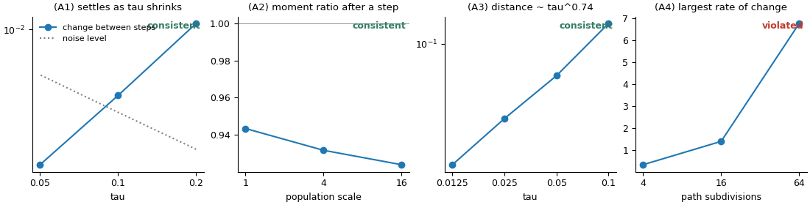
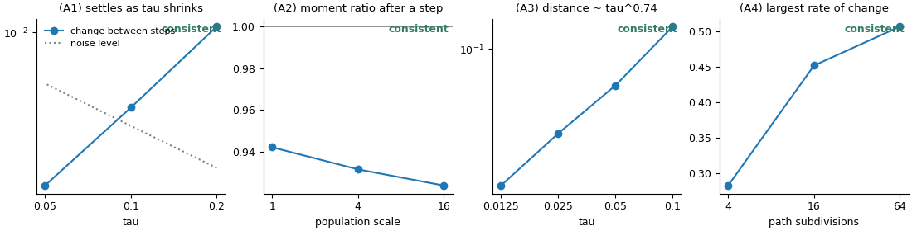

# Guide: checking a new operator

You have an idea for an operator and want to know, before proving anything or running
large benchmarks, whether it fits the theory. This takes three steps. The full worked
example is [Tutorial 2](../tutorials/02_checking_a_new_operator.py).

## Step 1: write the operator in one of four forms

Choose the form closest to how you think about the rule. Functions can take the whole
population as an extra argument when the rule depends on it (who is best, the mean, the
ranks).

**A move** (mutation, gradient-like step, attraction to a point):

```python
from evoscope.operators import Transport

# x -> x + tau * drift(x) + sqrt(tau) * noise
op = Transport(drift=lambda x, pop: pop.mean()-x,             # towards the population mean
               noise=lambda x, rng: .1*rng.standard_t(5, size=x.shape),   # any zero-mean noise
               name="M")
# isotropic Gaussian noise: Transport(drift=..., sigma=0.1)
```

**A reweighting** (selection of any kind, including rank-based):

```python
from evoscope.operators import Reweighting

# weights multiplied by exp(-tau * rate); individuals with a high rate lose weight
op = Reweighting(rate=lambda x, pop: my_rate(x, pop), name="S")
```

**A jump** (crossover, differential variation, restarts: anything that generates new
individuals from the population):

```python
from evoscope.operators import Jump

def offspring(pop, size, rng):                 # draw `size` new individuals from the population
    parents = pop.points[pop.sample(2*size, rng)].reshape(size, 2, -1)
    w = rng.uniform(-.25, 1.25, (size, 1))      # blend crossover
    return (1-w)*parents[:, 0]+w*parents[:, 1]

op = Jump(offspring=offspring, name="X")       # replaces a fraction tau of the population
```

**Anything else**: a function of the population, the step size and a random generator,
returning the new population (or just its points):

```python
from evoscope.operators import StepOperator
op = StepOperator(lambda pop, tau, rng: my_update(pop.points, tau, rng), name="T")
```

No derivatives or formulas are needed in any form.

## Step 2: choose populations and run the check

```python
from evoscope import checks
from evoscope.population import broad_gaussian, two_cluster

rng = np.random.default_rng(0)
populations = [broad_gaussian(16, d, rng), two_cluster(16, d, rng), broad_gaussian(16, d, rng)]
report = checks.check_operator(op, populations, fast=True)
print(report.summary())
report.plot("operator_check.png")
```

Use populations of the kinds your algorithm will meet. Broad and two-cluster populations
are a good default; add your own (for example a population near the optimum, or one
saved from a run) as `Population(points, weights)`. `fast=True` takes about a second;
without it the checks use more replicates and finer resolution.

## Step 3: read the verdicts and fix what fails

The report gives one verdict per condition (see [Reading the reports](reading-reports.md)):



*An operator pulling every individual towards the current best one. Conditions (A1)-(A3)
hold; continuity (A4) is violated: the largest rate of change of the effect keeps growing
as the check refines its resolution, the signature of a jump, here caused by the identity
of the best individual switching.*

| Verdict | Typical cause | Fix |
|---|---|---|
| (A1) or (A3) violated | the rule does not shrink with `tau` | move by `tau` times a drift and `sqrt(tau)` times noise, or replace a fraction `tau` of the population (`Jump`) |
| (A2) violated | moves that grow faster than the distance; heavy-tailed noise | normalize (divide by `sqrt(1 + |step|^2)`) or clip the move; use light-tailed noise |
| (A4) violated | best-of comparison, truncation by rank, other hard thresholds | soft versions: a softmin-weighted mean instead of the best point, smoothed ranks, sigmoids instead of steps |
| not resolved | random variation too large | more replicates (`fast=False`), larger populations |

After the fix:



## Next

An operator that passes can be combined with others: see [Combining operators](guide-assembly.md).
To see what it contributes on your problems before combining, compute its effect on the
mean gap over many populations:

```python
from evoscope import attribution, viz
from evoscope.operators import Assembly
result = attribution.coefficients(Assembly([op]), populations, f)     # f: your objective (see below)
viz.plot_component_coefficients(result)
```

The objective must provide `value(x)` (vectorized over the last axis); operators of the
move type with a formula also use `gradient` and `laplacian`. Wrap a plain function with
`Observable(f)`; missing derivatives are computed by finite differences.
